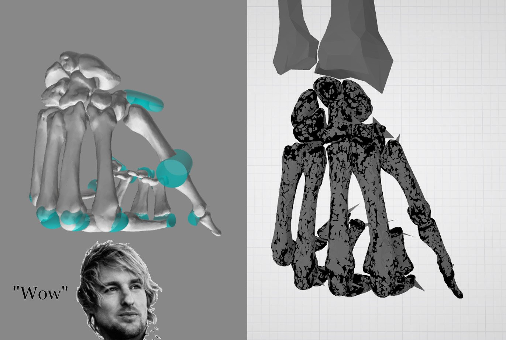

# 💪💪💪 Export OpenSim 4.0 models to STL
Want to export a model from OpenSim? igotchufam.

## Tutorial
1. Convert all Geometry files to STL. Either use your favorite program or if it's a VTP file, use the included converter. `python vtp2stl.py Geometry -o Geometry` should work for most models.
1. Edit the .osim file and change all mesh references to the new STL files. e.g. Find & Replace .vtp with .stl using your favorite text editor.
1. `python exportSTL.py your-opensim-file.osim -o your-export-directory` default directory is *output*
1. `python exportSTL.py your-opensim-file.osim -o your-export-directory -j` exports only the meshless bodies and joints

## Dependencies
1. Python 2.7 Environment
1. [OpenSim Python Wrapper](https://simtk-confluence.stanford.edu/display/OpenSim/Scripting+in+Python)
1. numpy
1. numpy-stl
1. vtk *(for the vtp2stl conversion)*

## Setup
**I highly recommend you create a new Python env in conda because of the strict Python 2.7 requirement and OpenSim's setup process**
1. `conda create -n opensin python=2.7`
1. `conda activate opensin` or `activate opensin`
1.  Follow OpenSim 4.0 installation [here](https://simtk-confluence.stanford.edu/display/OpenSim/Scripting+in+Python#ScriptinginPython-SettingupyourPythonscriptingenvironment) (YMMV for MacOS!)
1. `conda install numpy numpy-stl`
1. *Optional for vtp2stl.py* `conda install vtk`

## Whazzat reference_cube.stl &amp; reference_arrow.stl
- reference_cube.stl: Bodies with no mesh will have that in place. Replace that with your own stl file if you prefer other brilliant shapes. Also it's not actually a cube, but it makes up the coordinate axes x, y and z.
- refernce_arrow.stl: The "arrow" will point to the joint's axis, and the "arrow's width" will point to the current angle of the coordinate.

## Limitations
It's a quick and dirty thing I threw together. So it only exports the first attached mesh of each body. Please extend this and help make OpenSim more friendly for engineers!

## Wait I came here for that virtual world sim
This is for the *other* [OpenSim](https://opensim.stanford.edu/).
